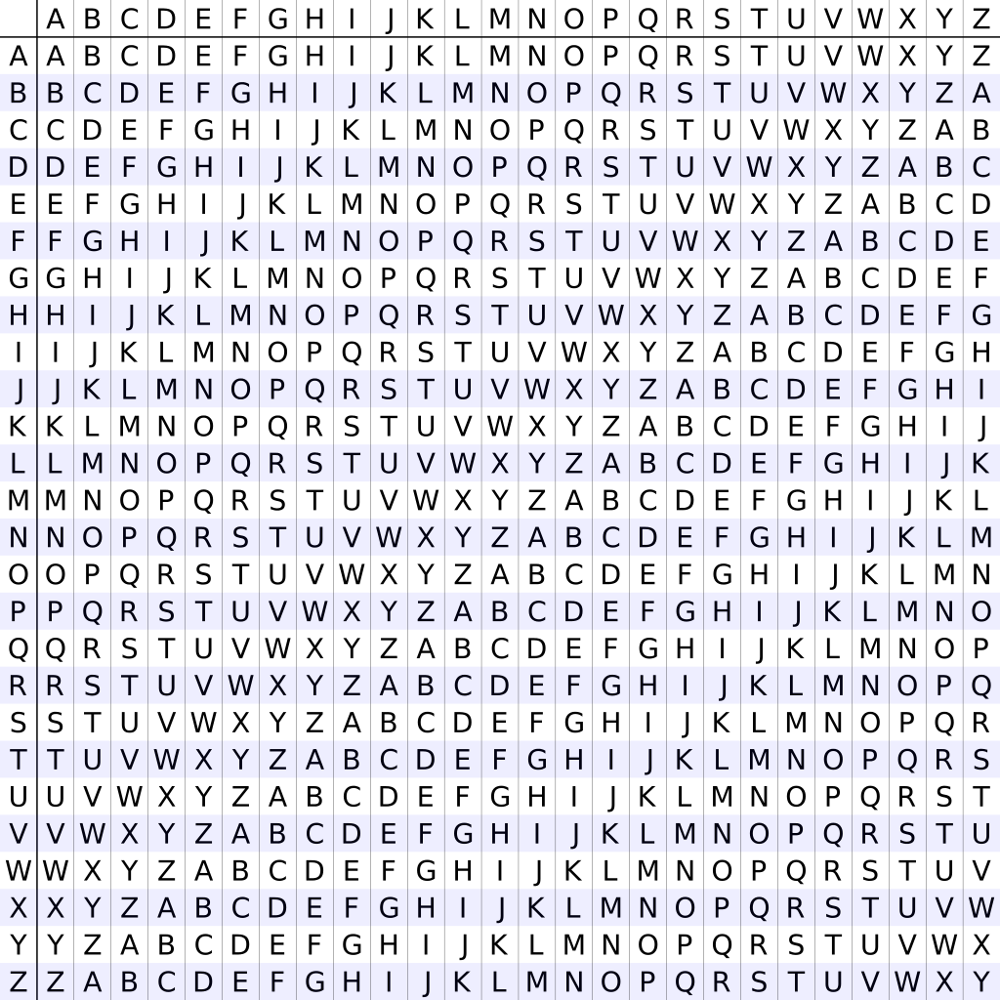

# extended-vigenere

This simple python tool offers an easy-to-use way to handle Vigenere encryption and decryption and can also support the traditional Vigenere table as well as any other custom character table that can be created (character or number addition/substraction, or shuffling).

## The Vigenere Puzzle

Everyone in the world of cryptography and puzzles is usually immediately introduced to the Vigenere encoding scheme which is usually
found in basic puzzles. This encoding/decoding technique can be seen as an expansion of the Caesar Cipher, where instead of a message
being shifted in the alphabet by a constant value, the amount of "shifting" is related to the position of each letter inside the message.
The behaviour of this shifting is simply controlled by the `key` which is another word that is usually repeated to overlap the message
and each of its letters induces a different shift to corresponding message's letters depending on the position of the letter's key on the
alphabet.

 

Even though the Vigenere cipher is very simple to understand and use, it is usually never extended to different alphabets or to include different
symbols and because of this there are no easy to find or use tools online that would account for that. Indeed, when I recently required such an
extended vigenere table, I wasn't able to find a useful tool online and ended up coding these simple functions.

#### Usage

When using custom character tables, one has to specify a list of the desired characters and positions.
```python
    characters = ["a", "b", "c", "d", "e", "f", "g", "h", "i", "j", "k", "l", "m",
                  "n", "o", "p", "q", "r", "s", "t", "u", "v", "w", "x", "y", "z",
                  "!", "@", "#", "$", "_"]
```
Then, encoding and decoding is simply performed by calling the relevant functions.
```python
    hidden_message = "this_is_a_test_message!"

    encoded_message = extended_vigenere.Encode(hidden_message, "secr@tkey", characters)
```

```python
    encoded_message = "glke!@#dyrxgepswilfeivw"

    decoded_message = extended_vigenere.Decode(Encoded_Message, "secr@tkey", characters)
```

## Requirements

The vigenere mapping uses `numpy` arrays to perform index shifting.